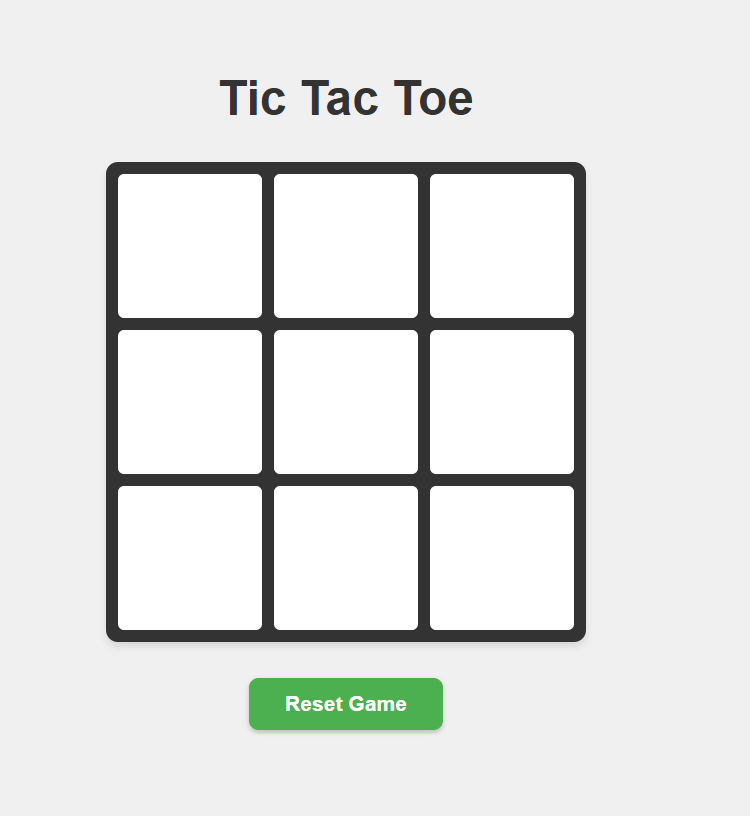
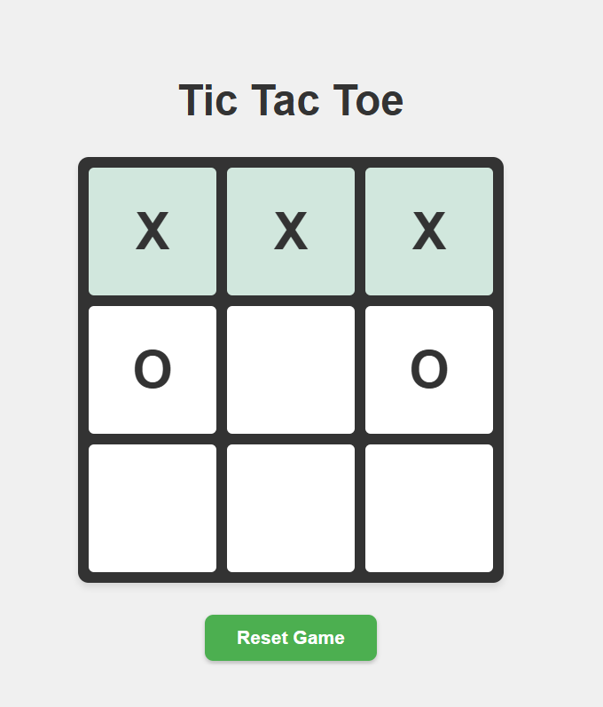

# TTT-Web

## Description
A classic Tic-Tac-Toe game where you play as **X** against the computer (O). The computer makes random moves, and the game detects wins, losses, and draws. Features a clean, modern design with a responsive grid layout.

## Features
-  Play as X against computer (O)
-  Win detection for all 8 possible winning combinations
-  Draw detection when board is full
-  Reset button to start a new game
-  Modern, responsive design with hover effects
-  Winning cells highlighted in green

## Technologies Used
- **HTML5** - Structure
- **CSS3** - Styling with Flexbox and Grid
- **JavaScript** - Game logic and DOM manipulation

## Screenshots

### Game Interface

### Winning State

## How to Play
1. Open `index.html` in your browser
2. Click any empty cell to place your X
3. The computer will automatically place an O
4. First to get 3 in a row (horizontal, vertical, or diagonal) wins!
5. Click "Reset Game" to start over

## Game Logic
- Player always goes first (X)
- Computer makes random moves from available cells
- Win conditions checked after each move
- Game ends when someone wins or board is full

## Future Improvements
- Add difficulty levels (easy/hard AI)
- Implement minimax algorithm for unbeatable AI
- Add score tracking
- Add sound effects
- Multiplayer mode

## Author
Ahmed Elsheshtawy

